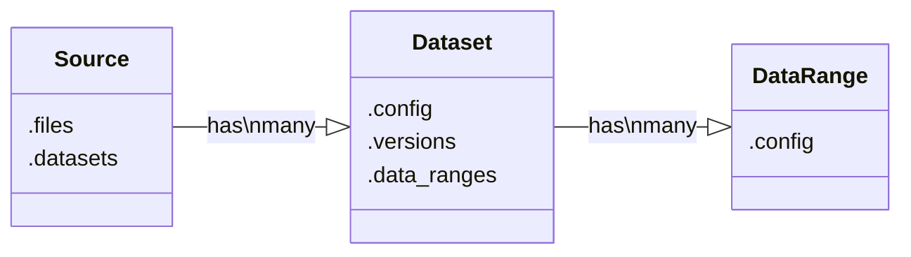

# Spreadsheet Extractor

Write YAML to extract data from spreadsheet files

## Abtraction logic


### Source
A Source represent an abstraction for spreadsheets.
    
A source is not bind to one file but rather a sequence of files that are created each period (day, week, ...).

It allows to define logic on top of all the files that have similar Datasets.

A Source can have multiple Datasets.


### Dataset
A Dataset represent a table/dataframe in worksheets.

A Dataset is not bind to one file/worksheet but rather multiple worksheets within all the files defined in the Source.

It is possible to have multiple datasets in a worksheet.

It allows to define logic on top of all the worksheets of the Source that have similar data.

A Dataset can have multiple DataRange, each tied to one version.


### DataRange
A DataRange represent a table/dataframe in a particular worksheet.

A DataRange is bind to a worksheet in a particular file.

A DataRange can be all data in the worksheet or a range within a worksheet.

It is possible to have multiple DataRanges in a worksheet.

It allows to define file-level logic.


## Dev Setup

### Manage project using Poetry
We are using [Poetry](https://python-poetry.org/docs/) to package the libaries and manage their dependencies.
All settings are defined in a `pyproject.toml` and all dependencies locked in a `poetry.lock`.

### Work with this package
- You must be inside the Dev Container
- You must activate the Python Virtualenv created by Poetry. To display the path of your Python virtualenv, run `poetry env info -p`

### Manage dependencies

#### Add a new dependency
```
poetry add a_pip_installable_package
```
#### Install dependencies
```
poetry install
```
#### Update dependencies
```
poetry update
```
#### Remove a dependency
```
poetry remove a_pip_installable_package
```

### Setup tests

In order to run tests in the Virtualenv created by Poetry, you need to set the Visual Studio Code Python interpreter path to the path of the Poetry Python interpreter :

1. Run `poetry env info` and copy the value of `Path` key inside the `Virtualenv` section.
2. Open any `.py` file and click on the Python version in the ribbon (bottom of the window, see image below)

3. Click on `+ Enter interpreter path...`, paste the Poetry Python interpreter path you copied in **step 1**, and hit Enter


Your Visual Studio Code environment is now configured to run Python tests in the Virtualenv created by Poetry.