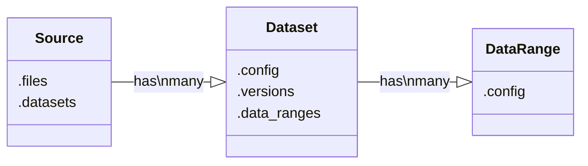

# Spreadsheet Extractor

Write YAML to extract data from spreadsheet files

## Usage

### Define source configuration
See [Spreasheet Extractor configuration](/src/configuration.md)

### Run Spreadsheet Extractor

#### CLI
```
spex source_config /path/to/source/config/folder /path/to/data/folder
```
***Tip** : If you set the `DATA_PATH` & `SPREADSHEET_EXTRACTOR_CONFIG_PATH` environment variables, you will only have to provide the `source_config`*

#### Python
```
config = get_config(
    "source_config",
    "/path/to/source/config/folder"
)
source = Source(config, "/path/to/data/folder")
source.load()
```

## Abtraction logic


### Source
A Source represent an abstraction for spreadsheets.
    
A source is not bind to one file but rather a sequence of files that are created each period (day, week, ...).

It allows to define logic on top of all the files that have similar Datasets.

A Source can have multiple Datasets.


### Dataset
A Dataset represent a table/dataframe in worksheets.

A Dataset is not bind to one file/worksheet but rather multiple worksheets within all the files defined in the Source.

It is possible to have multiple datasets in a worksheet.

It allows to define logic on top of all the worksheets of the Source that have similar data.

A Dataset can have multiple DataRange, each tied to one version.


### DataRange
A DataRange represent a table/dataframe in a particular worksheet.

A DataRange is bind to a worksheet in a particular file.

A DataRange can be all data in the worksheet or a range within a worksheet.

It is possible to have multiple DataRanges in a worksheet.

It allows to define file-level logic.